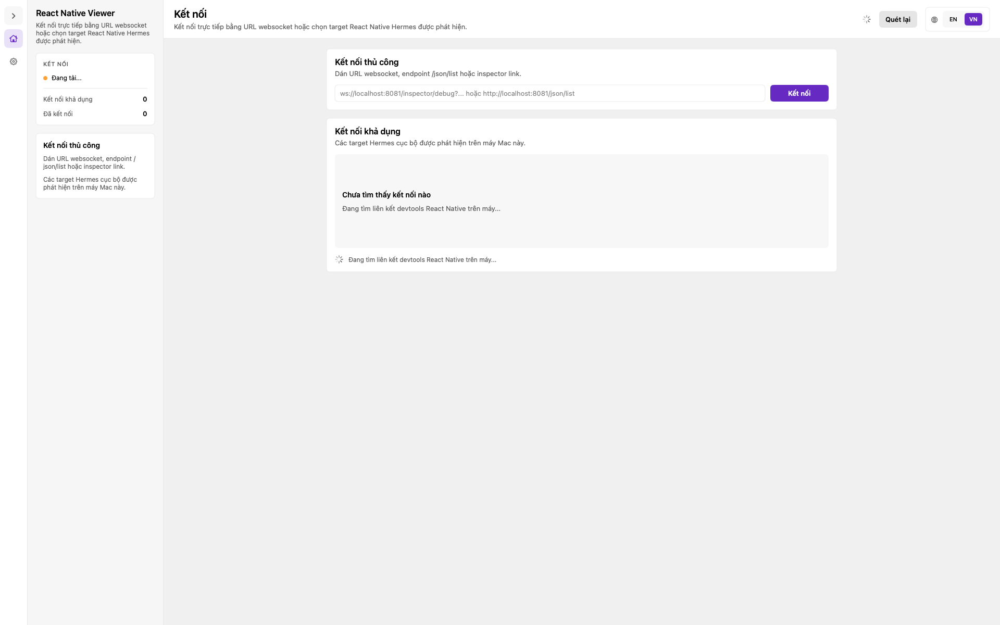

# React Native Viewer

React Native Viewer là ứng dụng macOS lấy cảm hứng từ Flipper, dùng để kiểm tra app React Native bằng giao diện desktop native, gọn và tập trung vào nhu cầu debug thực tế.




## Tính năng chính

- `Logs`: xem log console từ app React Native
- `Network`: xem request, response, header và body
- `Compare Text`: so sánh 2 đoạn văn bản
- `Json Graph`: trực quan hóa dữ liệu JSON dạng đồ thị

## Vì sao dùng React Native Viewer

- Ứng dụng macOS native
- Phong cách làm việc tương tự Flipper
- Hỗ trợ dữ liệu từ React Native DevTools và `rn_network_debugger`
- Phù hợp để debug hằng ngày cho app React Native

## Yêu cầu hệ thống

- macOS 14 trở lên
- Máy Mac dùng Apple Silicon hoặc Intel
- Xcode 26 trở lên nếu build từ source
- App React Native đã tích hợp `rn_network_debugger` nếu muốn nhận dữ liệu `Logs` và `Network`

## Cài bằng file `.dmg`

1. Tải file `.dmg`
2. Mở file `.dmg`
3. Kéo `React Native Viewer.app` vào thư mục `Applications`
4. Mở `Terminal`
5. Chạy lệnh:

```bash
xattr -dr com.apple.quarantine "/Applications/React Native Viewer.app"
```

6. Mở `React Native Viewer` từ thư mục `Applications`

## Cách dùng nhanh

1. Mở `React Native Viewer`
2. Chạy app React Native của bạn
3. Tích hợp và khởi động `rn_network_debugger` trong app
4. Kết nối app với Viewer
5. Kiểm tra dữ liệu qua các tab `Logs`, `Network`, `Compare Text`, `Json Graph`

## Tích hợp với React Native

Cài SDK:

```bash
npm install @quocandev27/rn_network_debugger
```

Cấu hình tối thiểu:

```ts
import {bootRNNetworkDebuggerWithPort} from '@quocandev27/rn_network_debugger';

bootRNNetworkDebuggerWithPort(38940);
```

Liên kết:

- NPM: https://www.npmjs.com/package/@quocandev27/rn_network_debugger
- SDK repo: https://github.com/DevMobileAn27/rn_network_debugger

## Build từ source

1. Mở `React Native Viewer.xcodeproj`
2. Build bằng Xcode 26 trở lên
3. Nếu cần bản phát hành, dùng `Archive` để export app

## Xử lý lỗi thường gặp

### App không mở được sau khi cài từ `.dmg`

Chạy:

```bash
xattr -dr com.apple.quarantine "/Applications/React Native Viewer.app"
```

### Không thấy thiết bị

- Đảm bảo app React Native đang chạy
- Đảm bảo `rn_network_debugger` đã được cài và khởi động
- Đảm bảo app có thể kết nối tới máy Mac đang mở Viewer

### Không thấy log hoặc network

- Build lại app React Native sau khi cập nhật SDK
- Kết nối lại app với Viewer
- Kiểm tra đúng port mà Viewer đang sử dụng

## Repository

- App repo: https://github.com/DevMobileAn27/React-Native-Viewer

## Giấy phép

Apache-2.0. Xem file [LICENSE](LICENSE).
